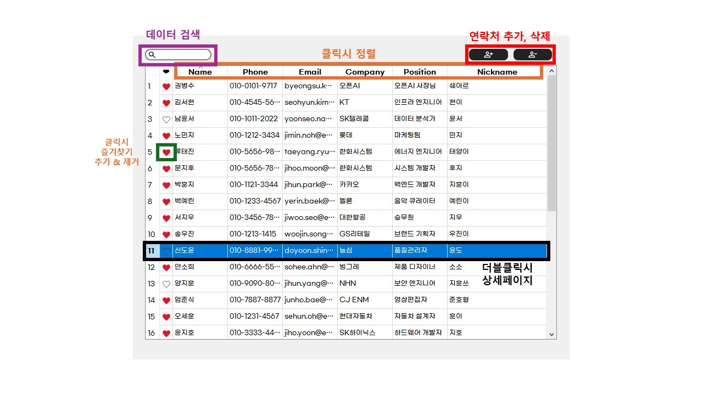

# 서버 연동 주소록 프로젝트

## 프로젝트 개요
이 프로젝트는 AWS Lambda와 DynamoDB를 활용한 실시간 데이터 동기화 기능을 갖춘 데스크톱 주소록 애플리케이션입니다.  
Qt 프레임워크(C++) 기반의 클라이언트와 서버리스 백엔드가 결합되어,  
사용자는 연락처(이름, 전화번호, 이메일, 회사, 직책, 별명, 이미지 등)를 추가, 삭제, 편집할 수 있습니다.  
즐겨찾기, 다중 컬럼 검색, 상세 정보 편집, 네트워크 오류 알림 등 다양한 편의 기능을 제공합니다.

## 스크린샷

### 메인 페이지 - 주소록 목록 및 검색

*메인 페이지에서는 연락처 목록 조회, 검색, 추가, 삭제 및 즐겨찾기 기능을 제공합니다.*

### 세부 페이지 - 연락처 정보 편집

*세부 페이지에서는 연락처의 모든 정보를 확인하고 편집할 수 있습니다.*

### 원본 이미지 보기

*읽기 모드에서 프로필 이미지 클릭 시 원본 이미지를 확인할 수 있습니다.*

---

## Summary
- **실시간 동기화**: AWS Lambda REST API를 통해 연락처 데이터가 서버와 즉시 동기화됩니다.
- **다중 컬럼 검색**: 이름, 전화번호, 이메일, 회사, 직책 등 여러 컬럼에서 실시간 검색이 가능합니다.
- **즐겨찾기 관리**: 하트 아이콘을 통한 즐겨찾기 표시 및 필터링 지원.
- **상세 정보 편집**: 별도의 상세 페이지에서 연락처의 모든 필드를 편집할 수 있습니다.
- **네트워크 오류 대응**: 서버 통신 중 로딩 다이얼로그 표시, 실패 시 사용자 알림 및 재시도 기능 내장.
- **환경설정 자동화**: `.env` 파일을 통한 Lambda 엔드포인트 등 환경변수 자동 로드.

---

## 실행 방법

1. **환경 준비**
   - Qt Creator 5.x 이상 설치
   - AWS Lambda 및 DynamoDB, API Gateway 구성
   - `.env` 파일에 Lambda 엔드포인트 설정
     ```
     AWS_LAMBDA_LOAD_URL="your-api-gateway-load-url"
     AWS_LAMBDA_SAVE_URL="your-api-gateway-save-url"
     ```

2. **빌드 및 실행**
   ```bash
   qmake && make -j4
   ./addressbook
   ```

3. **데이터 유효성**
   - 이름, 전화번호는 필수 입력
   - 전화번호는 `000-0000-0000` 형식만 허용

---

## 실행 시 주의할 점

- **네트워크 연결 필수**: 오프라인 모드 미지원, 반드시 인터넷 연결 필요
- **Lambda Cold Start**: 최초 호출 시 최대 5초 지연 가능
- **API 한도**: API Gateway 기본 요청 한도(10,000 RPM) 초과 주의
- **IAM 권한**: Lambda 실행 역할에 DynamoDB 접근 권한 필요
- **환경변수**: `.env` 파일이 없거나 경로가 잘못되면 서버 연동이 불가

---

## 주요 파일 및 클래스 설명

| 파일명/클래스                       | 역할 및 기능 요약 |
|-------------------------------------|------------------|
| **addressentry.h**                  | 연락처 데이터 구조체. 이름, 전화번호, 이메일, 회사, 직책, 별명, 즐겨찾기, 메모 등 필드와 getter/setter 제공
| **ImageEntry.h**                    | 연락처 이미지 데이터 관리. 이미지 경로, 원본/처리 이미지 키 관리
| **addressbookmodel.h**              | QAbstractTableModel 기반 주소록 데이터 모델. 연락처 추가/수정/삭제, 즐겨찾기 상태 관리, 서버 연동 URL 및 아이콘 관리
| **mainpagewidget.h**                | 메인 페이지 UI 위젯. AddressBookModel과 MultiColumnFilterProxyModel을 연결해 주소록 목록, 검색, 추가/삭제 등 제공
| **detailpagewidget.h**              | 연락처 상세 정보 및 편집/추가 UI 위젯. 선택된 연락처의 상세 정보 표시 및 편집, 저장/닫기/편집 버튼 등 UI 요소와 시그널/슬롯 연동
| **multicolumnfilterproxymodel.h**   | QSortFilterProxyModel 상속, 1~5열(이름, 전화번호, 이메일, 회사, 직책 등)에서 검색어가 포함된 행만 필터링하는 다중 컬럼 검색 지원
| **heartdelegate.h**                 | QTableView에서 즐겨찾기(하트) 아이콘 렌더링 및 클릭 이벤트 처리. 즐겨찾기 상태 토글 및 데이터 갱신
| **loadingdialog.h**                 | 서버 통신 중 표시되는 모달 다이얼로그. "통신 중..." 메시지로 사용자에게 네트워크 작업 진행 상황 안내
| **fontupdate.h**                    | 폰트 리소스 적용 유틸리티. 단일 위젯 또는 전체 자식 위젯에 폰트 일괄 적용
| **envloader.h**                     | `.env` 파일에서 환경변수 로드. Lambda URL 등 환경설정 자동화

---

## AWS Lambda 함수 설명

- **전체 연락처 조회**:  
  DynamoDB에서 모든 연락처를 가져와 이름 기준 오름차순 정렬 후 반환.  
  반환 형식: `{ "results": [ ... ] }`  
  예외 발생 시 500 코드와 에러 메시지 반환.

- **연락처 저장/삭제**:  
  - 삭제 요청: `"delete"` 키 포함 시 이름과 전화번호로 해당 연락처 삭제  
  - 저장 요청: `"results"` 키 포함 시 여러 연락처를 받아 각각 DynamoDB에 저장(추가/수정)  
  - 예외 발생 시 적절한 상태 코드와 메시지 반환

---

## 트러블슈팅 가이드

### 데이터 동기화 실패
- `.env` 파일이 올바른 위치에 있는지 확인 (앱 실행 파일과 동일 디렉토리)
- `.env` 파일의 Lambda URL이 올바른지 확인 (오타, 지역, 스테이지 등)
- 네트워크 연결 상태 확인 (VPN, 방화벽 등이 API Gateway 접근을 차단하는지)
- AWS Lambda 콘솔에서 함수 실행 권한 및 로그 확인

### Lambda 오류
- **Access Denied 오류**: IAM 역할에 DynamoDB 및 S3 접근 권한 확인
- **Timeout 오류**: Lambda 함수 제한 시간 확인 (기본 3초)
- **초기 지연**: Cold Start 현상으로 첫 호출 시 5초까지 지연 가능, 재시도 필요

### UI 관련 문제
- **테이블 뷰 갱신 안됨**: `ui->addressTableView->reset();` 호출 또는 애플리케이션 재시작
- **즐겨찾기 상태 불일치**: 해당 항목의 인덱스로 `emit dataChanged(index, index);` 호출
- **이미지 로드 실패**: 네트워크 연결 확인 및 이미지 URL이 유효한지 검사

### 빌드 오류
- **Qt 모듈 누락**: `QT += network widgets` 등 필요한 모듈이 .pro 파일에 포함되었는지 확인
- **의존성 오류**: AWS SDK 등 외부 라이브러리가 필요한 경우 설치 확인

---

## 개발 분야 소개

- **권병수**: 서버와 클라이언트 간 데이터 동기화, AWS Lambda 및 DynamoDB 연동, 데이터 불러오기/저장/삭제 로직 담당
- **김도현**: UI 설계 및 구현, 연락처 편집/추가/검색 기능, 커스텀 위젯(즐겨찾기, 다중 컬럼 검색 등) 담당

---

## 환경 설정 (.env 파일)

1. **위치**: 실행 파일이 있는 디렉토리에 `.env` 파일을 생성해야 합니다
   - Release 모드: `build/Qt${QT_VERSION_MAJOR}/Release/.env`
   - Debug 모드: `build/Qt${QT_VERSION_MAJOR}/Debug/.env`
   - 실행 파일과 동일한 디렉토리에 위치해야 앱이 자동으로 로드합니다

2. **필수 환경변수**:
   ```
   AWS_LAMBDA_LOAD_URL="https://xxxxx.execute-api.region.amazonaws.com/stage/load"
   AWS_LAMBDA_SAVE_URL="https://xxxxx.execute-api.region.amazonaws.com/stage/save"
   AWS_LAMBDA_RESIZE_URL="https://xxxxx.execute-api.region.amazonaws.com/stage/resize"
   ```

3. **경로 관련 문제 해결**:
   - `envloader.h`의 `EnvLoader::loadEnvironment()` 함수는 실행 파일의 디렉토리에서 `.env` 파일을 찾습니다
   - 만약 `.env` 파일을 찾을 수 없다는 오류가 발생하면, 콘솔에 출력되는 현재 작업 디렉토리를 확인하고 해당 위치에 파일을 생성하세요
   - Qt Creator에서 실행 시 작업 디렉토리가 빌드 디렉토리로 설정됩니다

---

## 즐겨찾기 기능

- **표시 방법**: 연락처 목록의 하트 아이콘(❤)을 클릭하여 즐겨찾기 설정/해제
- **데이터 저장**: 즐겨찾기 상태는 DynamoDB의 `favorite` 필드에 Boolean 값으로 저장됨
- **UI 갱신**: 즐겨찾기 상태 변경 시 `dataChanged` 시그널 발생하여 UI 자동 갱신
- **정렬 방법**: 테이블 헤더의 하트 아이콘(❤)을 클릭하면 즐겨찾기된 항목이 상단에 표시됨
  - 즐겨찾기 열 헤더 클릭 → 즐겨찾기 항목 우선 정렬
  - 다시 클릭 → 정렬 순서 반전 (즐겨찾기 아닌 항목 우선)

---

## 기술 아키텍처

클라이언트 (Qt/C++) <───> API Gateway <───> AWS Lambda <───> DynamoDB/S3
    │                                           │
    │                                           │
    └───────────────> 이미지 요청 <─────────────┘
                      (S3 Direct)

### 클라이언트 아키텍처 (MVC 패턴)
- **Model**: AddressBookModel - 데이터 관리, AWS 연동
- **View**: MainPageWidget, DetailPageWidget - 사용자 인터페이스
- **Controller**: 각 위젯 내 이벤트 핸들러, 시그널-슬롯 연결

### 서버 아키텍처
- **API Gateway**: REST API 엔드포인트 제공 (CORS 활성화)
- **Lambda 함수**: 데이터 처리 로직 (Node.js)
- **DynamoDB**: 주소록 데이터 저장 (NoSQL)
- **S3**: 프로필 이미지 저장 (원본 및 리사이징)

---
